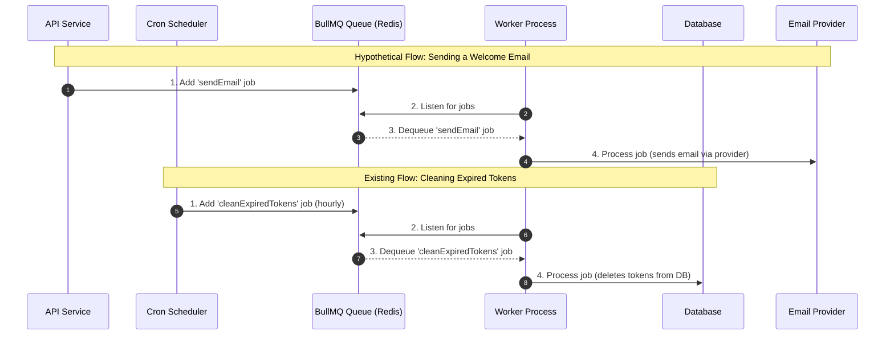

# Background Jobs with BullMQ

This template integrates [BullMQ](https://docs.bullmq.io/) for handling background jobs and asynchronous tasks. BullMQ is a fast, robust, and Redis-backed queueing system that allows you to offload time-consuming operations from your main application thread, improving responsiveness and scalability.

The template comes pre-configured with one background job: a recurring task to clean up expired blacklisted JWTs from the database.

## Why Use Background Jobs?

*   **Improving User Experience:** Offload long-running tasks (e.g., sending emails, processing images) so API requests can return quickly.
*   **Reliability & Scheduling:** Run tasks on a schedule or ensure they are processed even if the main application crashes, with features like retries and persistent queues.
*   **Scalability:** Distribute workloads across multiple worker processes or servers.

## 1. The Existing Job: Token Cleanup

The template includes a cron job that runs every hour to clean out the `BlacklistedToken` table. This prevents the table from growing indefinitely.

### How It Works

1.  **Scheduler (`src/utils/tokenCleanup.ts`):** A `node-cron` scheduler is configured to run every 60 minutes.
2.  **Add Job to Queue:** On schedule, the cron job calls `addTokenCleanupJob` from `src/jobs/queue.ts`, which adds a `cleanExpiredTokens` job to the `tokenCleanup` queue.
3.  **Worker Processes Job (`src/jobs/worker.ts`):** The BullMQ worker, which is listening to the `tokenCleanup` queue, picks up the job.
4.  **Execute Logic:** The worker executes `processTokenCleanupJob`, which runs a Prisma query to `deleteMany` tokens where the `expires` date is in the past.

This entire flow is already set up and requires no additional configuration.

## Visual Flow of Background Jobs

The following diagram illustrates how both scheduled and event-driven jobs are handled by the BullMQ system.



## 2. Extending with a New Job (Example)

While the template only includes the token cleanup job, it is structured to be easily extensible. Let's walk through an example of how to add a new job for sending a welcome email after a user registers.

### Step 1: Define a New Queue

In `src/jobs/queue.ts`, define and export a new queue for emails.

```typescript
// src/jobs/queue.ts

// ... existing redisConnection and defaultQueueOptions

export const tokenCleanupQueueName = 'tokenCleanup';
export const emailQueueName = 'emailQueue'; // 1. Add new queue name

// ... existing addTokenCleanupJob function

// 2. Create a function to add jobs to the new email queue
export const addSendEmailJob = async (queue: Queue, data: { to: string; subject: string; text: string }) => {
  await queue.add('sendEmail', data, defaultQueueOptions.defaultJobOptions);
};
```

### Step 2: Add Logic to the Worker

In `src/jobs/worker.ts`, update the worker process to handle jobs from the new `emailQueue`. Since the worker logic can get complex, it's best to handle different job names.

```typescript
// src/jobs/worker.ts
import { Job } from 'bullmq';
import { prisma } from '../config/db';
import logger from '../utils/logger';
import dotenv from 'dotenv';
// Hypothetical email service
import { emailService } from '../services'; 

dotenv.config();

// Main processing function
export const processJob = async (job: Job) => {
  logger.info(`Processing job ${job.id} of type ${job.name} from queue ${job.queueName}`);

  switch (job.queueName) {
    case 'tokenCleanup':
      if (job.name === 'cleanExpiredTokens') {
        return processTokenCleanupJob(job);
      }
      break;
    
    case 'emailQueue': // 1. Handle the new queue
      if (job.name === 'sendEmail') {
        return processSendEmailJob(job);
      }
      break;

    default:
      throw new Error(`No processor for queue ${job.queueName}`);
  }
};

// Existing token cleanup logic
async function processTokenCleanupJob(job: Job) {
  try {
    const { count } = await prisma.blacklistedToken.deleteMany({
      where: { expires: { lt: new Date() } },
    });
    logger.info(`Cleaned up ${count} expired blacklisted tokens.`);
    return { cleanedCount: count };
  } catch (error) {
    logger.error(error, 'Error cleaning up expired tokens in worker:');
    throw error;
  }
}

// 2. Create a new function for the email job
async function processSendEmailJob(job: Job) {
  try {
    const { to, subject, text } = job.data;
    // Assuming you have an emailService that can send emails
    await emailService.sendEmail(to, subject, text);
    logger.info(`Sent email to ${to}`);
    return { status: 'ok' };
  } catch (error) {
    logger.error(error, `Error sending email to ${job.data.to}:`);
    throw error;
  }
}
```

### Step 3: Instantiate the New Queue and Worker

In `src/server.ts`, where the application is initialized, you need to create the new queue and worker instances.

```typescript
// src/server.ts
// ... other imports
import { Queue, Worker } from 'bullmq';
import { tokenCleanupQueueName, emailQueueName } from './jobs/queue'; // Import new queue name
import { processJob } from './jobs/worker'; // Import the main processor

// ... inside startServer function

// Initialize BullMQ Queues
const tokenCleanupQueue = new Queue(tokenCleanupQueueName, { connection: redisConnection });
const emailQueue = new Queue(emailQueueName, { connection: redisConnection }); // 1. Instantiate new queue

// Initialize BullMQ Workers
const worker = new Worker(
  [tokenCleanupQueueName, emailQueueName], // 2. Listen to both queues
  processJob, 
  { connection: redisConnection }
);

// ... worker event listeners

// Start the cron job for token cleanup
startTokenCleanupJob(tokenCleanupQueue);
```

### Step 4: Add the Job from Your Service

Finally, trigger the job from your business logic. For example, after a user is created in `src/services/auth.service.ts`.

```typescript
// src/services/auth.service.ts
// ... other imports
import { addSendEmailJob } from '../jobs/queue';
import { Queue } from 'bullmq';

// This is a simplified example. In a real app, you would inject the queue
// or use a singleton pattern to access it.
const emailQueue = new Queue('emailQueue', { connection: { host: '...', port: ... } });

// ... inside registerUser function, after user is created
const registerUser = async (userData: RegisterUserBody): Promise<User> => {
  // ... existing logic to create user
  const user = await userService.createUser(userData);

  // Add a job to the email queue
  await addSendEmailJob(emailQueue, {
    to: user.email,
    subject: 'Welcome!',
    text: `Hi ${user.username}, welcome to our platform!`,
  });

  return user;
};
```

This example demonstrates how the existing BullMQ setup can be extended to accommodate new background tasks in a structured and scalable way.
