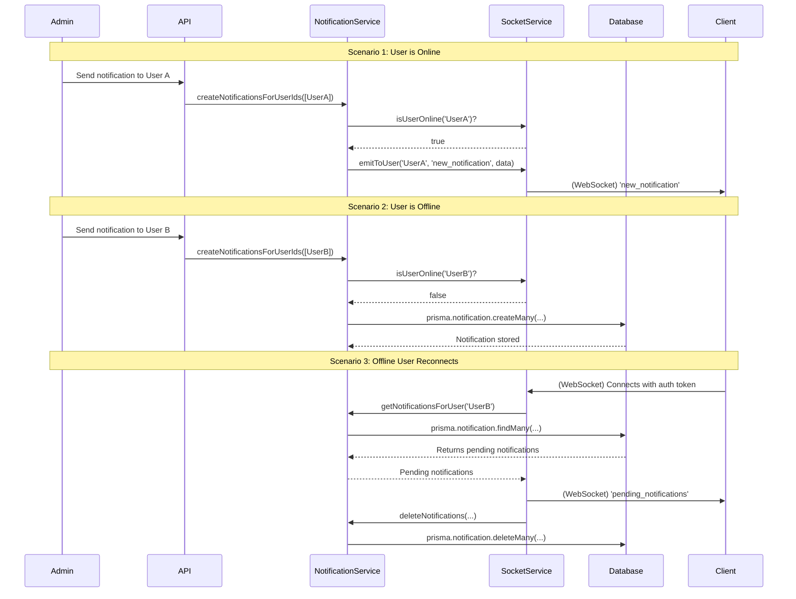

# Socket.IO Service and Real-time Notifications

This section details the implementation of real-time communication using Socket.IO, including how the client connects, how notifications are handled for both online and offline users, and the role of the `public` directory in serving the Socket.IO client.

## Overview

The application leverages Socket.IO to provide real-time notifications to users. This functionality is crucial for features like administrative alerts or instant updates. The system is designed to ensure that users receive notifications even if they are offline at the time the notification is sent.

## Architecture

### Server-side (Node.js with Socket.IO)

The core of the Socket.IO server is managed by the `SocketService` (`src/services/socket.service.ts`) and integrated into the main Express application in `src/server.ts`.

1.  **Initialization**:
    *   In `src/server.ts`, the `SocketService` is initialized by calling `socketService.init(server)`, where `server` is the HTTP server instance.
    *   CORS is configured to allow connections from specified origins.
    *   A custom `socketAuthMiddleware` (`src/middleware/socket.middleware.ts`) is applied to authenticate incoming Socket.IO connections using JWT tokens. This ensures that only authenticated users can establish a real-time connection.

2.  **Connection Handling**:
    *   When a client connects, the `socketService` logs the connection and, if the user is authenticated, joins the socket to a private room named after the `userId`. This allows for targeted communication to individual users.
    *   **Offline Notification Delivery**: Upon a successful connection, the `socketService` checks the database for any pending notifications for that user using `notificationService.getNotificationsForUser`. If found, these notifications are immediately emitted to the newly connected client via the `pending_notifications` event. After successful delivery, these notifications are deleted from the database using `notificationService.deleteNotifications`.
    *   Disconnection events are also handled and logged.

3.  **Notification Creation (`notificationService.ts`)**:
    *   The `notificationService.createNotificationsForUserIds` function (`src/services/notification.service.ts`) is responsible for sending notifications.
    *   For each target user, it first checks if the user is currently online using `socketService.isUserOnline(userId)`.
    *   If the user is online, the notification is emitted directly to their socket using `socketService.emitToUser` with the `new_notification` event (or a custom event if specified).
    *   If the user is offline, the notification message is persisted in the database (e.g., in a `Notification` table) to be delivered later when the user reconnects.

### Client-side (`public/client.js` and `public/index.html`)

The `public` directory serves a simple HTML page (`index.html`) and a JavaScript file (`client.js`) that demonstrate how to connect to and interact with the Socket.IO server.

1.  **Serving the Client**:
    *   In `src/server.ts`, the line `app.use('/client', express.static(path.join(__dirname, '../public')));` configures Express to serve static files from the `public` directory under the `/client` URL path. This means `public/index.html` is accessible at `/client/index.html` and `public/client.js` at `/client/client.js`.

2.  **Client Connection**:
    *   `public/index.html` includes the Socket.IO client library from a CDN and then loads `public/client.js`.
    *   `public/client.js` handles the connection logic:
        *   It prompts the user for a JWT access token.
        *   When the "Connect" button is clicked, it initializes a Socket.IO connection, passing the JWT token in the `Authorization` header via the `extraHeaders` option. This token is then used by the server's `socketAuthMiddleware` for authentication.
        *   It listens for various Socket.IO events:
            *   `connect`: Indicates a successful connection.
            *   `disconnect`: Indicates a disconnection.
            *   `connect_error`: Reports any connection errors.
            *   `new_notification`: Receives real-time notifications sent by the admin or other services.
            *   `pending_notifications`: Receives notifications that were stored in the database while the user was offline and are now being delivered upon reconnection.

## How Offline Notifications Work

The system ensures reliable notification delivery through a combination of real-time emission and database persistence:

1.  **Admin/Service sends notification**: An admin or another service calls `notificationService.createNotificationsForUserIds` to send a message to one or more users.
2.  **Online Check**: For each user, `socketService.isUserOnline` is called.
3.  **Direct Emission (if online)**: If the user is online, the notification is immediately sent via Socket.IO using `socketService.emitToUser`.
4.  **Database Persistence (if offline)**: If the user is offline, the notification is saved to the `Notification` table in the database.
5.  **Reconnection Delivery**: When an offline user later connects to the Socket.IO server, the `socketService` automatically queries the database for any pending notifications for that user.
6.  **Delivery and Cleanup**: Any found pending notifications are sent to the user, and then promptly deleted from the database to prevent re-sending.

This robust mechanism guarantees that users receive important messages regardless of their real-time connectivity status.

## Notification Flow Diagram

The following diagram illustrates the complete lifecycle of a notification, covering online, offline, and reconnection scenarios.

